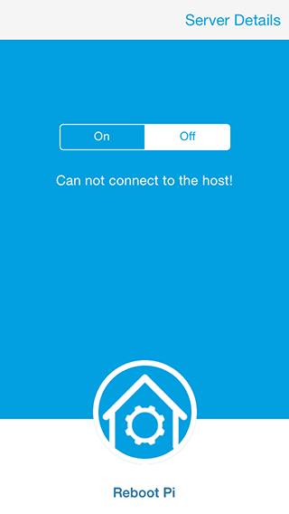

SocketApp For Raspberry Pi
=========

an iphone app example for doing socket io into a raspberry pi

This app will:

- Turn on and off GPIO 7

- Read the cpu temp of the raspberry pi

- Determine all the current users logged into the raspberry pi

